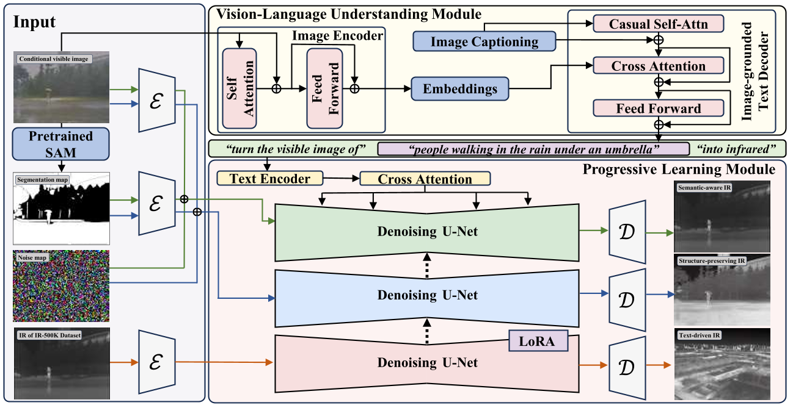

<div align="center">
<h1>DiffV2IR: Visible-to-Infrared Diffusion Model via  Vision-Language Understanding </h1>

<div align="center">
    Lingyan Ran<sup>1</sup>, Lidong Wang<sup>1</sup>, Guangcong Wang<sup>2</sup>, Peng Wang<sup>1</sup>, Yanning Zhang<sup>1</sup>
</div>
<div align="center">
    Northwestern Polytechnical University<sup>1</sup>, Great Bay University<sup>2</sup>
</div>

###  												[Project](https://diffv2ir.github.io/) | [YouTube](https://youtu.be/YbUuvjnfejE) | [arXiv](https://arxiv.org/abs/2503.19012) 
</div>

>**TL;DR**: We present DiffV2IR, a novel framework for visible-to-infrared image translation comprising two key elements: a Progressive Learning Module (PLM) and a Vision-Language Understanding Module (VLUM), which markedly improves the performance of V2IR. 
>
>**Abstract:** The task of translating visible-to-infrared images (V2IR) is inherently challenging due to three main obstacles: 1) achieving semantic-aware translation, 2) managing the diverse wavelength spectrum in infrared imagery, and 3) the scarcity of comprehensive infrared datasets. Current leading methods tend to treat V2IR as a conventional image-to-image synthesis challenge, often overlooking these specific issues. To address this, we introduce DiffV2IR, a novel framework for image translation comprising two key elements: a Progressive Learning Module (PLM) and a Vision-Language Understanding Module (VLUM). PLM features an adaptive diffusion model architecture that leverages multi-stage knowledge learning to infrared transition from full-range to target wavelength. 
>To improve V2IR translation, VLUM incorporates unified Vision-Language Understanding. 
>We also collected a large infrared dataset, IR-500K, which includes 500,000 infrared images compiled by various scenes and objects under various environmental conditions. Through the combination of PLM, VLUM, and the extensive IR-500K dataset, DiffV2IR markedly improves the performance of V2IR. Experiments validate DiffV2IR's excellence in producing high-quality translations, establishing its efficacy and broad applicability. The code, dataset, and DiffV2IR model will be available.

<div align="center">
<tr>
    
</tr>
</div>


>**Framework Overview:** DiffV2IR mainly consists of two components, i.e., Progressive Learning Module (PLM) and Vision-Language Understanding Module (VLUM). 
>Specifically, 1) as for PLM, we first establish foundational knowledge of infrared imaging properties utilizing our collected IR-500K dataset. Then we use visible-infrared image pairs to learn cross-modal transformation and finally conduct the refinement on the specific infrared imaging style. 
>2) as for VLUM, we incorporate unified vision-language understanding, including detailed language descriptions and segmentation maps, to make DiffV2IR semantic-aware and structure-preserving. 

## 1. Installation
We recommend using the virtual environment (conda) to run the code easily.

```
conda create -n DiffV2IR python=3.10.15
conda activate DiffV2IR
pip install -r requirements.txt
```

## 2. Dataset

### 2.1 Download IR-500K dataset
- Download the IR-500K dataset here
- https://pan.quark.cn/s/47a6b1a99d8e
- Access Code：NWn2
- or follow this link:
- https://huggingface.co/datasets/Lidong26/IR-500K/tree/main
### 2.2 Use your own dataset
- Our training scripts expect the dataset to be in the following format
```
dataset_name
├── rgb
│   ├── 000000.png
│   ├── 000001.png
│   └── ...
├── ir
│   ├── 000000.png
│   ├── 000001.png
│   └── ...
├── seg
│   ├── 000000.png
│   ├── 000001.png
│   └── ...
├── seeds.json
```

The subfolder seg can be produced by generating masks from the entire image using SAM and then running "process_masks.py".


## 3. Training 

Please set the variables in configs/train.yaml and run:
```
python main.py --base configs/train.yaml --name your_name --gpus 1 --train
```

## 4. Test 
Please set the variables in configs/generate.yaml and run:
```
python infer.py --ckpt your_ckpt --input input_folder --output output_folder
```

## 5. Evaluate on your own dataset (Kaggle-ready)

`eval_flir.py` runs RGB -> IR inference on a FLIR-aligned dataset and reports
CLIP + SSIM + PSNR + LPIPS against the ground-truth IR.

Dataset layout (FLIR ADAS 1.3 aligned). Both layouts are auto-detected:

```
<dataset>/                        <dataset>/
├── align/                        ├── JPEGImages/      # FLIR_XXXXX_RGB.jpg, FLIR_XXXXX_PreviewData.jpeg
│   ├── JPEGImages/               ├── Annotations/     # FLIR_XXXXX_PreviewData.xml
│   ├── Annotations/              ├── AnnotatedImages/
│   ├── align_train.txt           ├── align_train.txt
│   └── align_validation.txt      └── align_validation.txt
└── ... (or JPEGImages etc.)
```

Split files are one stem per line (with or without the `_PreviewData` suffix).
Pass `--dataset` as the folder that contains the `align/` subdir (the nested
`align/` is auto-detected), and pick the split file with
`--split train|validation` (default `validation`).

```bash
python eval_flir.py \
  --dataset /kaggle/input/flir-aligned \
  --output /kaggle/output \
  --seg-mode sam             # sam | xml | zero | deeplab
```

By default the **whole split is evaluated** (`--num-samples 0` = every stem in
`align_validation.txt`), and **FID is computed over that full set** (GT IR vs
generated IR) using torchvision InceptionV3 truncated at `Mixed_7c`. A
dedicated `metrics.json` is written with `FID`, `LPIPS`, `PSNR`, `SSIM`; the
per-sample CLIP/PSNR/SSIM/LPIPS means and stds go to `summary.json`.
Visualization covers the first `--visualize` samples (default 20): one
`*_triplet.png` per sample (`RGB | GT-IR | gen-IR [| seg]`) plus a single
`grid_20.png` that tiles all 20. Pass `--no-fid` to skip FID, `--no-fp16` to
keep the diffusion model in fp32.

Smoke-test one image first with `--seg-mode zero --num-samples 1 --steps 10`,
then run the full set with `--seg-mode sam --steps 50`. On a 15 GB T4 the
diffusion model runs fp16, so a 512x512 image takes ~25-30 s at 50 steps —
budget ~30-60 min per 100 validation images.

Weights are auto-downloaded on first run (DiffV2IR FLIR.ckpt from HuggingFace,
BLIP caption model, SAM ViT-B) into `--cache-dir ./weights`. To skip the ~9 GB
download each run, upload the weights as a Kaggle dataset and pass
`--ckpt /kaggle/input/<...>/FLIR.ckpt --blip-ckpt ... --sam-checkpoint ...`.

On Kaggle, if `torch==1.13.1` fails to install on your image, remove the
`torch`/`torchvision` pins from `requirements.txt` (Kaggle preinstalls torch 2.x)
and install `kornia>=0.7` instead.

## 6. Pretrained Checkpoints
We updated the pretrained checkpoint after Stage 1/2 of PLM for further training and the pretrained checkpoint of M3FD Dataset and FLIR Dataset mentioned in the paper.
https://pan.quark.cn/s/e2f28304ee90
Access Code：EWCz
or
https://huggingface.co/datasets/Lidong26/IR-500K/tree/main


## 7. Comments

Our codebase is based on the [Stable Diffusion codebase](https://github.com/CompVis/stable-diffusion).

## 8. Citation

If you find this useful for your research, please cite the our paper.

```
@misc{ran2025diffv2irvisibletoinfrareddiffusionmodel,
      title={DiffV2IR: Visible-to-Infrared Diffusion Model via Vision-Language Understanding}, 
      author={Lingyan Ran and Lidong Wang and Guangcong Wang and Peng Wang and Yanning Zhang},
      year={2025},
      eprint={2503.19012},
      archivePrefix={arXiv},
      primaryClass={cs.CV},
      url={https://arxiv.org/abs/2503.19012}, 
}
```


